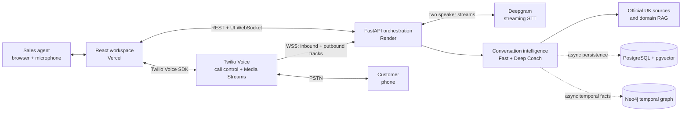
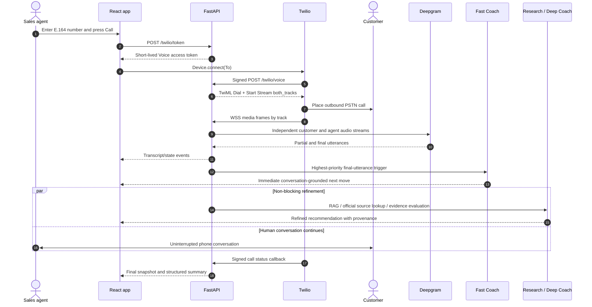
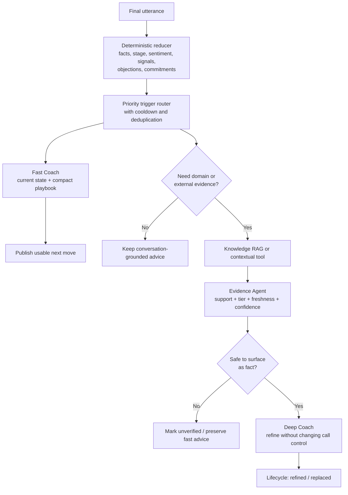
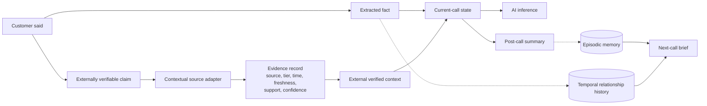

# VaakSetu — Realtime AI Sales Coach

[](https://www.python.org/)
[](https://fastapi.tiangolo.com/)
[](https://react.dev/)
[](https://www.typescriptlang.org/)
[](#verification)

VaakSetu is a browser-based, realtime AI copilot for UK property sales calls. An agent dials a customer from the web app; Twilio carries the human conversation and forks separate agent/customer audio tracks; Deepgram transcribes them; a deterministic conversation layer extracts facts, objections, signals, commitments, stage, sentiment, and temperature; then a two-speed coaching system gives an immediate next move and asynchronously refines it with retrieved knowledge and source-backed evidence.

The project implements the Quantum Gandiva AI candidate assessment and its approved Single Source of Truth (SSOT) extensions as a deployable React + FastAPI system.

> [!IMPORTANT]
> The public application and API are deployed in real-provider mode, and Twilio, Deepgram, the LLM, and official UK external data report configured. A two-human carrier call has **not yet completed the final recorded acceptance rehearsal**, so real ringing, audio, speaker attribution, and provider latency are not claimed as verified. PostgreSQL and Neo4j adapters are implemented and contract-tested but are not attached to the public API at the time of this report.

## Live deployment

| Surface | URL | Verified state on 2026-08-12 |
|---|---|---|
| Web application | [vaaksetu-psi.vercel.app](https://vaaksetu-psi.vercel.app) | HTTP 200 |
| FastAPI backend | [vaaksetu-api.onrender.com](https://vaaksetu-api.onrender.com) | `/health` returns `ok`, mode `real` |
| OpenAPI | [API documentation](https://vaaksetu-api.onrender.com/docs) | Public API contract |
| Provider readiness | [Readiness endpoint](https://vaaksetu-api.onrender.com/health/providers) | Twilio, STT, LLM, external data ready; DB and graph not attached |

Render's free service may sleep when idle, so the first API request can take longer than normal.

## What was requested and what was built

| Assessment requirement | Implementation |
|---|---|
| Dial and end one phone call from the browser | Twilio Voice JavaScript SDK, short-lived server token, TwiML App, E.164 validation, authoritative call-status callbacks |
| Show a live, speaker-separated transcript | Twilio `both_tracks` Media Stream, deterministic track-to-speaker mapping, independent Deepgram streaming sessions, partial/final transcript semantics |
| Provide useful live coaching | Typed conversation state, event triggers, cooldowns, immediate Fast Coach, evidence-aware Deep Coach refinement |
| Produce a structured post-call summary | Customer facts, signals, objections, commitments, verified context, unverified claims, inferences, next steps, and follow-up memory |
| Research the domain and design prompts | Buyer/vendor discovery and progression model, bounded structured prompts, retrieval rules, safety constraints, and abstention behavior |
| Explain production evolution | Explicit prototype bottlenecks, horizontal streaming gateways, Redis hot state, durable event bus, workers, multi-tenancy, security, SLOs, and cost controls |
| Deliver a working full-stack prototype | React 19/Vite frontend on Vercel and Python 3.12/FastAPI backend on Render, with local synthetic and real-provider modes |
| Provide a reproducible end-to-end walkthrough | One-click **Demo** flow that automatically creates a synthetic call, plays six agent/customer turns, surfaces facts, objection, evidence and coaching, then completes with a structured summary |

### Product and engineering additions

Beyond the minimum call/transcript/coach surface, the approved SSOT was implemented with:

- four visibly distinct epistemic categories: customer statement, extracted fact, externally verified context, and AI inference;
- event-triggered property-domain RAG instead of retrieval on every transcript fragment;
- source tier, URL, publication/retrieval time, freshness, support status, and confidence attached to evidence;
- recommendation lifecycle and useful/not-useful feedback;
- short-term, episodic, relational, and domain memory boundaries with pre-call briefs;
- temporal Neo4j facts so changed preferences are closed rather than overwritten;
- replay deduplication, media-gap detection, STT reconnect, UI snapshot recovery, and idempotent call completion;
- structured safe logs, trace correlation, Prometheus metrics, agent trajectories, LangSmith wiring, offline evaluation, and behavioral fault injection;
- a visibly labelled deterministic synthetic mode so the product is testable without pretending fixture data is live.

## Architecture

### System context



The core reliability rule is that the **telephony plane never depends on the intelligence plane**. STT, LLM, retrieval, databases, graph, evaluation, or UI delivery may degrade; none is allowed to instruct Twilio to terminate the human call.

### Realtime call sequence



### Two-speed coaching



This avoids the classic realtime failure mode where every token waits for an LLM or web search. Partial transcript text is rendered but does not trigger durable extraction or coaching. Final customer utterances update state; only meaningful events start intelligence work.

### Evidence and memory boundaries



Evidence is not flattened into model output. Unsupported or conflicting material remains explicitly unverified and cannot be silently promoted to fact.

## Technical design

| Layer | Choice | Reason |
|---|---|---|
| Frontend | React 19, TypeScript, Vite | Fast, typed single-page agent workspace |
| Browser telephony | Twilio Voice JS SDK | Required browser-to-phone call path and client call lifecycle |
| Backend | FastAPI, Python 3.12, Uvicorn | Async WebSocket/provider orchestration and typed API contracts |
| Call control | Twilio Programmable Voice + TwiML App | Token-scoped outbound calling and signed webhook lifecycle |
| Media | Twilio unidirectional Media Streams | Native `inbound_track` / `outbound_track` separation without diarization |
| Speech recognition | Deepgram streaming | Mu-law streaming, interim/final results, keepalive, reconnect |
| Orchestration | Deterministic router + LangGraph | Predictable hot path with explicit bounded agent flow |
| LLM | Environment-selected structured provider | Model independence in business logic and schema-validated responses |
| Operational/semantic data | PostgreSQL + pgvector | Calls, state, recommendations, summaries, evaluations, and vector RAG |
| Relationship memory | Neo4j | Temporal preferences, commitments, and entity relationships |
| External context | Official UK adapter + cache | High-trust evidence, freshness, provenance, and graceful abstention |
| Observability | JSON logs, OpenTelemetry, Prometheus, LangSmith | Cross-component diagnosis without recording raw audio |
| Hosting | Vercel + Render | Independent static frontend and WebSocket-capable Python API |

## Repository layout

```text
.
├── apps/
│   ├── api/
│   │   ├── app/
│   │   │   ├── agents/          # Fast, deep, research, evidence, memory, summary
│   │   │   ├── conversation/    # Reducer, triggers, replay deduplication
│   │   │   ├── db/              # SQLAlchemy models and pgvector migration
│   │   │   ├── memory/          # Relational, vector, and temporal graph stores
│   │   │   ├── observability/   # Logs, metrics, tracing, trajectories
│   │   │   ├── streaming/       # Media sequencing and speaker mapping
│   │   │   ├── stt/             # Deepgram and synthetic adapters
│   │   │   ├── telephony/       # Tokens, TwiML, webhook validation
│   │   │   ├── tools/           # Cached synthetic and official UK sources
│   │   │   └── websocket/       # Twilio media and browser event sockets
│   │   └── tests/
│   └── web/
│       ├── src/components/       # Call, transcript, coach, evidence, health, summary
│       ├── src/hooks/            # Reconnecting session WebSocket
│       ├── src/lib/              # API, Twilio client, authoritative reducer
│       └── tests/                # Playwright desktop/mobile flows
├── docs/                         # Architecture, research, runbooks, evidence, report
├── evals/                        # Buyer/vendor/context/failure evaluation cases
├── scripts/                      # Offline eval and fault-injection runners
├── docker-compose.yml            # Local pgvector and Neo4j
└── render.yaml                   # Backend deployment blueprint
```

## Run locally

### Prerequisites

- Node.js 20+
- Python 3.12+
- [`uv`](https://docs.astral.sh/uv/)
- Docker Desktop for PostgreSQL/pgvector and Neo4j

### Synthetic mode — fastest reproducible path

Synthetic mode exercises the complete product contract with deterministic provider fixtures. It is visibly labelled in the UI and never represents fixture evidence as live data.

```powershell
Copy-Item .env.example .env
npm install
uv sync --project apps/api
docker compose up -d

# Required only when reusing an older PostgreSQL volume.
Get-Content apps/api/app/db/migrations/001_initial.sql -Raw |
  docker compose exec -T postgres psql -U salescoach -d salescoach

# Terminal 1
uv run --project apps/api uvicorn app.main:app --app-dir apps/api --reload --port 8000

# Terminal 2
npm --workspace apps/web run dev
```

Open `http://localhost:5173`.

### One-click automated demo

Click **Demo** beside **Call** to run the complete deterministic buyer scenario. No phone number, Twilio call, or microphone permission is needed. The UI progressively shows six speaker-labelled turns, qualification facts, a price objection, a market claim with evidence handling, a viewing commitment, and the final call summary. **Cancel demo** safely completes the synthetic session if the walkthrough is interrupted.

This path calls the real FastAPI orchestration endpoints using synthetic input; it is not a hard-coded summary screen. It is deliberately separate from **Call**, which remains the live Twilio and microphone path.

### Real-provider mode

1. Copy `.env.example` to `.env` and populate the server-side provider variables. Never commit `.env`.
2. Set `APP_MODE=real`, `EXTERNAL_DATA_MODE=real`, and an HTTPS `PUBLIC_BASE_URL` reachable by Twilio.
3. Configure the TwiML App Voice Request URL as `https://<api-host>/twilio/voice` using HTTP POST.
4. Set the frontend's `VITE_API_URL` to the API base URL.
5. On a Twilio trial account, verify the destination number before calling.
6. Confirm `/health/providers` before the rehearsal; any `blocking: true` realtime provider must be fixed first.

Required variables are documented without values in [.env.example](.env.example). Secrets stay on the backend; the browser receives only a short-lived Twilio access token.

## API and event surface

| Method | Path | Purpose |
|---|---|---|
| `GET` | `/health` | Process health and active mode |
| `GET` | `/health/providers` | Capability-level readiness and missing configuration |
| `POST` | `/twilio/token` | Short-lived browser Voice token |
| `POST` | `/twilio/voice` | Signed TwiML App webhook |
| `POST` | `/twilio/status` | Signed authoritative call lifecycle callback |
| `POST` | `/demo/calls` | Create deterministic synthetic session |
| `POST` | `/demo/calls/{call_id}/utterances` | Feed a synthetic utterance |
| `GET` | `/calls/{call_id}` | Reconnectable authoritative snapshot |
| `POST` | `/calls/{call_id}/end` | Canonical idempotent call completion |
| `GET` | `/calls/{call_id}/summary` | Structured post-call summary |
| `GET` | `/calls/{call_id}/trajectories` | Privacy-minimized decision trace |
| `GET` | `/customers/{customer_id}/precall-brief` | Follow-up context |
| `POST` | `/recommendations/{id}/feedback` | Human usefulness signal |
| `GET` | `/evidence/{id}` | Evidence and provenance |
| `GET` | `/metrics` | Prometheus exposition |
| `WS` | `/ws/media/{call_id}` | Twilio media ingress |
| `WS` | `/ws/ui/{call_id}` | Snapshot-first frontend event stream |

All application events carry `event_id`, `timestamp`, `trace_id`, `call_id`, `session_id`, `type`, and typed payload data. Duplicate events are ignored by the frontend reducer.

## Verification

Run the complete credential-independent verification suite:

```powershell
uv run --project apps/api pytest apps/api/tests -q
npm --workspace apps/web test -- --run
npm --workspace apps/web run typecheck
npm --workspace apps/web run build
npm --workspace apps/web run e2e
uv run --project apps/api python scripts/run_evals.py
uv run --project apps/api python scripts/fault_injection.py
```

Latest recorded result:

| Check | Result |
|---|---:|
| Backend unit/integration | 111 passed |
| Frontend component/contract | 22 passed |
| TypeScript typecheck | Passed |
| Vite production build | Passed |
| Playwright desktop + Pixel 7 | 6 passed |
| Offline evaluation scenarios | 28/28 passed |
| Intelligence-plane fault scenarios | 13/13 kept the call connected |
| Total automated checks | 180 passed |

Automated provider contract tests are not evidence of carrier behavior. The exact SSOT 35-step real-call acceptance rehearsal remains the final live gate.

## Reliability, privacy, and safety

- Twilio webhook signatures are enforced in real mode.
- Phone numbers are normalized to E.164 and persisted customer identity is hash-based.
- Raw audio is streamed, not retained.
- Safe structured logs exclude raw audio, full transcripts/prompts, credentials, and contact values.
- Database, graph, tools, LLM, evaluation, and frontend delivery are intelligence-plane dependencies; their failure degrades features, not call control.
- Unsupported external topics abstain instead of fabricating an answer.
- `DATA_RETENTION_DAYS` defaults to 90; a production deployment still needs a scheduled physical deletion/audit job.
- This prototype is outbound-only, one active call/user, and UK-property oriented. Authentication, RBAC, tenancy, CRM integration, inbound/IVR, regional data controls, and autoscaling belong to production evolution.

## Documentation

- [Project submission report](docs/PROJECT_SUBMISSION_REPORT.md) — end-to-end requirement, design, implementation, deployment, and evidence narrative
- [SSOT requirement matrix](docs/SSOT_REQUIREMENT_MATRIX.md) — evidence-backed coverage boundary
- [Prototype architecture](docs/ARCHITECTURE.md) and [production system design](docs/SYSTEM_DESIGN.md)
- [Domain research and prompt design](docs/DOMAIN_RESEARCH_AND_PROMPT_DESIGN.md)
- [Provenance and follow-up memory](docs/PROVENANCE_AND_MEMORY.md)
- [Observability](docs/OBSERVABILITY.md), [E2E testing](docs/E2E_TESTING.md), and [verification report](docs/VERIFICATION_REPORT.md)
- [Demo script](docs/DEMO_SCRIPT.md), [limitations](docs/LIMITATIONS.md), and [synthetic-data disclosure](docs/SYNTHETIC_DATA.md)
- [UI design system](docs/UI_DESIGN_SYSTEM.md) and [accepted visual reference](docs/design/ai-sales-coach-primary.png)

## Submission boundary

The repository is complete for code, automated verification, deployment configuration, research, prompt/system design, observability, evaluation, runbooks, and documentation. The only claim intentionally withheld is full live-call acceptance. That claim should be made only after the documented 35-step rehearsal proves real PSTN ringing/audio, two-speaker attribution, live transcript cadence, in-call coaching, failure recovery, and follow-up memory against reachable durable stores.
