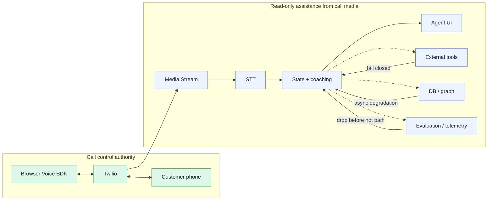
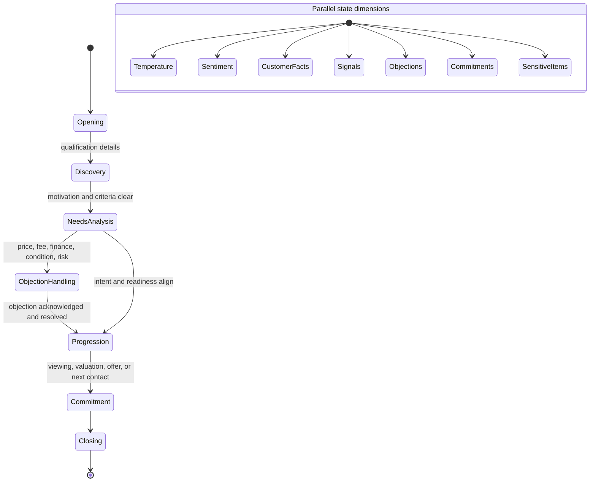
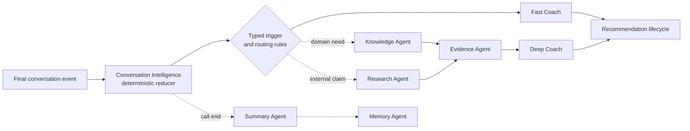
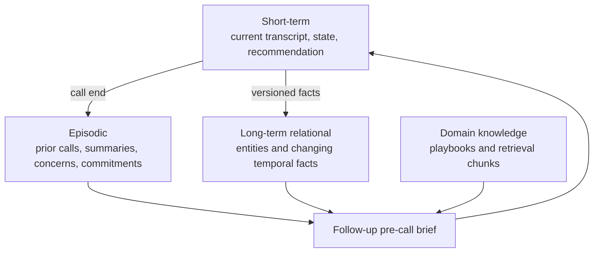
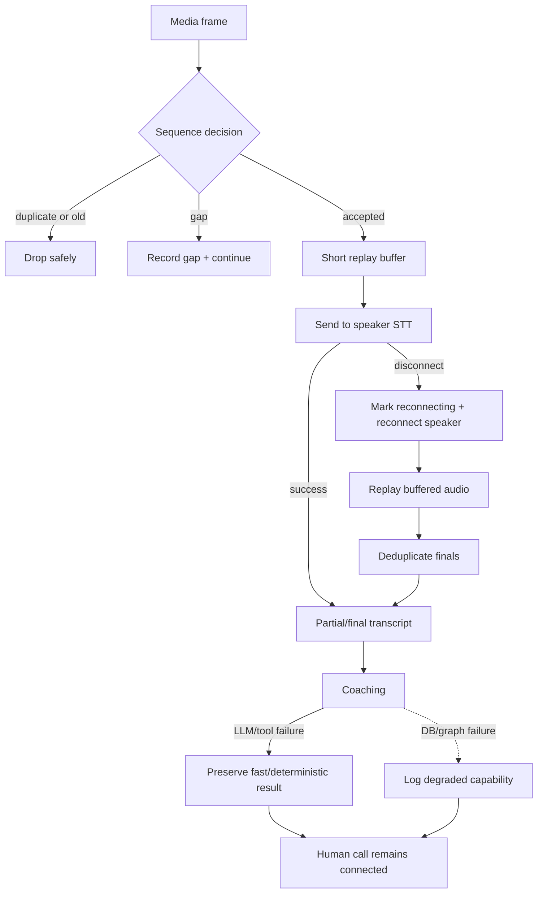
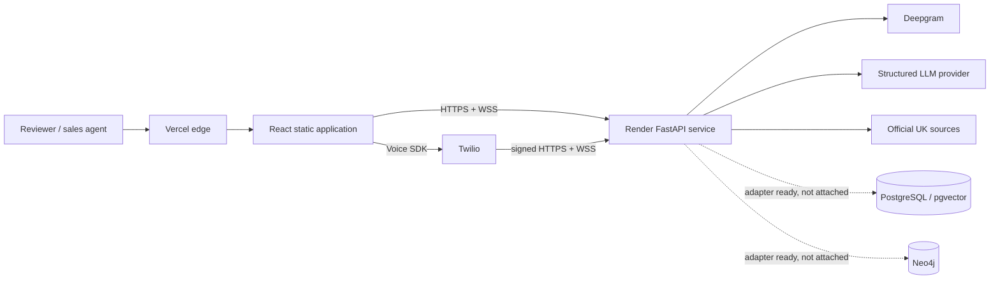
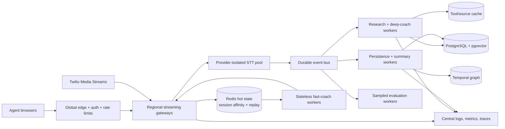

# VaakSetu — AI Sales Coach Project Submission Report

**Assessment:** Quantum Gandiva AI realtime real-estate sales coach  
**Implementation date:** 2026-08-12  
**Repository:** [Ajey95/VaakSetu](https://github.com/Ajey95/VaakSetu)  
**Frontend:** [vaaksetu-psi.vercel.app](https://vaaksetu-psi.vercel.app)  
**Backend:** [vaaksetu-api.onrender.com](https://vaaksetu-api.onrender.com)  
**Status:** Code, automated evidence, deployment, and submission documentation complete; final two-human live-call acceptance rehearsal pending

## 1. Executive summary

VaakSetu is a realtime browser copilot for a property sales agent. It connects an agent to a real telephone number through Twilio, receives the agent and customer as distinct media tracks, converts each track to a correctly attributed transcript, maintains typed conversation state, and presents a concise next-best action while the call continues. When an utterance requires property knowledge or external validation, an asynchronous path retrieves context, assesses evidence quality, and refines the recommendation without delaying the immediate coach.

The implementation is deliberately not an autonomous calling bot. It assists a human-to-human conversation. This distinction drives the architecture: Twilio owns the call, while transcription, intelligence, retrieval, storage, evaluation, and UI delivery sit on an isolated assistance plane. Any of those capabilities can degrade without receiving authority to end the phone call.

The delivered system includes:

- a responsive React/TypeScript agent workspace;
- Twilio browser calling and signed webhook/TwiML handling;
- speaker-separated Twilio Media Streams and per-speaker Deepgram sessions;
- deterministic transcript reduction and trigger routing;
- fast and evidence-refined coaching through a bounded LangGraph workflow;
- domain RAG, contextual official-source retrieval, evidence provenance, and abstention;
- PostgreSQL/pgvector and temporal Neo4j implementations with in-memory fallbacks;
- pre-call briefs, post-call summaries, recommendation feedback, and memory;
- end-to-end correlation, safe logs, metrics, traces, trajectories, and asynchronous evaluation;
- 170 passing automated checks across backend, frontend, browser, evaluation, and fault behavior;
- Vercel and Render deployments with real Twilio, STT, LLM, and external-source configuration.

The final claim boundary is explicit: no submission artifact treats automated provider-contract tests as proof of carrier behavior. The exact 35-step SSOT acceptance sequence still requires one recorded two-human phone rehearsal. PostgreSQL and Neo4j are implemented and contract-tested, but the public API currently reports those two durable providers as not attached.

## 2. Source brief and interpretation

The supplied assignment required a pragmatic prototype covering five main areas:

1. Place and end a phone call from a browser through Twilio.
2. Show a live transcript with correct agent/customer attribution.
3. Give context-aware, non-generic coaching during the call.
4. Produce a useful structured summary after the call.
5. Explain domain research, prompts, architecture, production scaling, reliability, observability, and trade-offs.

The approved SSOT extended that baseline with evidence provenance, two-speed coaching, structured state, multiple bounded agents, memory horizons, PostgreSQL/pgvector, a temporal knowledge graph, reliability controls, system-wide observability, offline/online evaluation, and a detailed final acceptance procedure.

### 2.1 Design interpretation

The assignment was interpreted as a **realtime decision-support system**, not a transcription demo with an LLM attached. Four consequences followed:

- **The call must outlive AI failure.** Telephony control is isolated from all intelligence-plane dependencies.
- **The transcript is an event stream, not a prompt.** Partial text is for visual immediacy; final utterances become stable state-changing events.
- **A useful answer now is better than a perfect answer too late.** Fast coaching is published before retrieval and deeper reasoning.
- **Every factual suggestion needs an epistemic identity.** Customer statements, extracted facts, external evidence, and AI inference remain distinct.

## 3. Requirement-to-implementation traceability

| What the assessment asked for | How it was implemented | Evidence boundary |
|---|---|---|
| Browser phone controls | React call panel, E.164 validation, Twilio Voice `Device`, dial/ringing/connected/ended states, canonical hangup | Component, API, and browser tested; real carrier rehearsal pending |
| Twilio call to a real phone | Server-generated token scoped to a TwiML App; signed `/twilio/voice`; `<Dial>` to destination | Token/TwiML/signature contracts tested; real ring/audio pending |
| Separate speakers | Twilio `both_tracks`; inbound maps to customer and outbound maps to agent | Mapping and media integration automated; live attribution pending |
| Live transcript | Independent streaming STT sessions, partial/final semantics, event WebSocket, snapshot reconnect | Automated with provider fixtures/contracts; live cadence pending |
| Realtime coaching | Structured reducer, priority event triggers, Fast Coach, Deep Coach refinement | Ordering, specificity, cooldown, and failure paths tested |
| Highlight facts/signals/objections | Typed state with customer facts, signals, objections, commitments, sensitive items, stage, sentiment, temperature | Backend reducer and frontend rendering tested |
| Post-call summary | Typed summary separates facts, signals, objections, commitments, verified context, unverified claims, inferences, next steps, memory | Automated integration and two-call test |
| Domain research and prompt design | Buyer/vendor qualification, progression rules, compact state prompts, safety and abstention rules | Documented and encoded in reducer/agents |
| Production system design | Bottlenecks, scalable topology, provider isolation, queues, SLOs, privacy, tenancy, and cost controls | Documented architecture; production scale not claimed |
| Evidence-backed external context | Context router, official UK source boundary, cache, evidence evaluation, provenance fields | Success/failure/cache paths tested; coverage intentionally narrow |
| RAG | Event-triggered knowledge retrieval with pgvector-ready store | Retrieval and refinement tested |
| Durable and temporal memory | PostgreSQL repository, pgvector migration, Neo4j temporal adapter, pre-call brief | Contract/integration tested; public deployment not attached |
| Reliability | Media sequencing, replay dedup, audio buffer, retries, reconnects, snapshot recovery, fallbacks, idempotency | 13/13 behavioral fault scenarios kept call state connected |
| Observability and evaluation | Correlated JSON logs, OpenTelemetry spans, Prometheus, trajectories, offline suite, async online eval, feedback | Automated contracts and 28/28 eval set |

### 3.1 SSOT Definition of Done status

The mandatory SSOT checklist contains 65 items. The evidence audit records 59 as implemented with automated or documented evidence. Six behaviors remain live-provider acceptance items:

1. a real Twilio phone call connects;
2. real browser dial/hangup completes end to end;
3. actual call audio produces a Deepgram transcript;
4. the two real humans remain correctly attributed;
5. transcript cadence feels live under provider/network latency;
6. coaching visibly updates during that real call.

The exact 35-step final acceptance test is a single ordered rehearsal and has not been represented as passed. Credential-independent portions have been tested separately, but only the complete live sequence can close that gate.

## 4. End-to-end solution architecture

### 4.1 Logical component view

```mermaid
flowchart TB
    subgraph Client["Agent workspace"]
        UI["React UI"]
        Voice["Twilio Voice SDK"]
        Reducer["Authoritative event reducer"]
    end

    subgraph Telephony["Telephony plane"]
        Call["Twilio call control"]
        PSTN["Customer phone"]
        Media["Both-track Media Stream"]
    end

    subgraph Realtime["Realtime assistance plane"]
        API["FastAPI REST + WebSockets"]
        Seq["Sequencer + short buffer"]
        STT["Per-speaker Deepgram manager"]
        State["Conversation reducer"]
        Router["Deterministic trigger router"]
        Fast["Fast Coach"]
    end

    subgraph Async["Asynchronous intelligence"]
        Knowledge["Knowledge Agent / RAG"]
        Research["Context Research Agent"]
        Evidence["Evidence Agent"]
        Deep["Deep Coach"]
        Summary["Summary Agent"]
        Memory["Memory Agent"]
        Eval["Online evaluation"]
    end

    subgraph Data["Data and observability"]
        PG[("PostgreSQL + pgvector")]
        KG[("Neo4j temporal graph")]
        Official["Official UK sources + cache"]
        Obs["Logs + traces + metrics + trajectories")]
    end

    UI <--> Reducer
    Voice <--> Call
    Call <--> PSTN
    Call --> Media
    Media --> API --> Seq --> STT --> State --> Router
    Router --> Fast --> API --> Reducer
    Router -.-> Knowledge
    Router -.-> Research --> Official
    Knowledge --> Evidence
    Research --> Evidence --> Deep --> API
    State -.-> Summary -.-> Memory
    Memory -.-> PG
    Memory -.-> KG
    State -.-> Eval
    API -.-> Obs
    Async -.-> Obs
```

### 4.2 Plane separation and failure authority



There is intentionally no edge from an intelligence component to Twilio call termination. The backend reports degraded capability through health/events and preserves the human call.

## 5. Detailed runtime flow

### 5.1 Before the call

1. The frontend requests `/health` and `/health/providers`.
2. The UI displays synthetic/real mode and provider readiness separately for Twilio, STT, LLM, database, graph, and external data.
3. The agent enters an E.164-compatible phone number.
4. A known customer can receive a pre-call brief built from prior summary, concern, commitment, unresolved items, suggested opening, and do-not-repeat hints.

### 5.2 Call setup

1. The browser requests `/twilio/token` with a bounded identity.
2. FastAPI creates a short-lived Twilio access token containing an outgoing Voice Grant for the configured TwiML App.
3. `Device.connect` passes the destination to Twilio.
4. Twilio signs and POSTs to `/twilio/voice`.
5. The backend validates the signature in real mode, normalizes the number, registers the call, and returns TwiML.
6. TwiML starts an unidirectional stream for `both_tracks` and dials through the configured caller ID.
7. Signed status callbacks update the authoritative parent call lifecycle.

### 5.3 Streaming and transcript semantics

Twilio sends mu-law media frames with a sequence number, timestamp, and track. The media gateway:

- ignores duplicate and out-of-order packets;
- records sequence gaps without killing the stream;
- maps `inbound_track` to `customer` and `outbound_track` to `agent`;
- sends each speaker to an independent STT stream;
- buffers a short replay window for reconnect;
- deduplicates replayed final transcript content;
- publishes partial text for visual immediacy;
- lets only final utterances update stable state and trigger coaching.

### 5.4 Conversation state



The state transition is deterministic and cumulative. It captures:

- buyer/vendor/unknown call type;
- stage, temperature, and sentiment;
- budget, finance, location, bedrooms, timeline, chain, and other typed facts;
- high-intent/casual signals;
- price, fee, finance, condition, location, and risk objections;
- viewings, valuations, offers, and follow-up commitments;
- unresolved questions and externally verifiable claims;
- sensitive financial or personal details, handled separately from ordinary facts;
- current and previous recommendations.

### 5.5 Trigger engine

The router does not invoke intelligence for every word. It evaluates stable final utterances and produces priority-ranked triggers such as:

- price or fee objection;
- mortgage status;
- timeline mention;
- viewing or other commitment;
- market or mortgage-rate claim;
- environment or energy-performance question;
- property-domain question.

Cooldowns and replay deduplication prevent suggestion spam. The highest-priority relevant event gets a fast recommendation; retrieval flags decide which optional asynchronous nodes run.

## 6. Multi-agent intelligence design

The term “multi-agent” is used narrowly. These are bounded specialist components with typed input/output, not an unconstrained supervisor chat loop.



| Component | Responsibility | Hot-path rule |
|---|---|---|
| Conversation Intelligence | Convert final utterances into typed state and candidate triggers | Deterministic, always available |
| Fast Coach | Give one specific, immediately usable action grounded in current state | Runs first and never waits for research |
| Knowledge Agent | Retrieve compact property playbook or internal knowledge context | Only on domain triggers |
| Research Agent | Call the context-appropriate external source | Only for claims/questions needing live context |
| Evidence Agent | Score support, source tier, freshness, conflicts, and surfacing safety | Cannot turn unsupported content into fact |
| Deep Coach | Refine the existing action with safe evidence | Optional; failure preserves fast card |
| Summary Agent | Produce category-separated post-call output | Runs after call completion |
| Memory Agent | Persist summary/facts and build follow-up context | Async; graph and DB never block the call |

LangGraph makes the fast → research → evidence → deep path explicit. The live service also exposes a split `fast_recommend` / `refine` interface so the fast result can be published before awaiting downstream nodes.

## 7. Coaching and prompt strategy

### 7.1 Sales-domain model

Buyer calls are modeled around motivation, preferred location, property type/bedrooms, budget, deposit or mortgage agreement, timeline, chain, decision makers, and willingness to view or offer. Vendor calls focus on motivation, property context, target date, access, valuation evidence, pricing realism, fees, marketing, communication, and instruction readiness.

Progression rules prevent premature calls to action:

- propose a viewing only when criteria, affordability, and intent align;
- discuss an offer after interest and buying position are clear;
- propose a valuation after vendor motivation and property context are known;
- seek instruction after valuation evidence, service, fees, and obligations are understood.

### 7.2 Prompt inputs and outputs

Prompts receive the newest final utterance, its speaker, a compact recent window, and typed state. The Fast Coach receives compact playbook constraints. The Deep Coach additionally receives only relevant retrieved knowledge and evidence that passed evaluation. Full transcripts are not repeatedly resent.

Outputs are schema-constrained:

- one `next_move` the agent can say or do now;
- a brief reason connected to the latest customer point;
- low/medium/high confidence;
- fast/deep type;
- lifecycle state;
- evidence IDs where applicable.

Safety rules forbid generic advice, protected-trait reasoning, unsupported property/market assertions, invented facts, and mixing customer claims with independently verified evidence.

## 8. Evidence, provenance, and external context

### 8.1 Epistemic model

| Category | Meaning | UI/decision behavior |
|---|---|---|
| Customer said | Direct utterance | Quotable as customer position, not objective truth |
| Extracted fact | Structured representation of a customer statement | Used for state and qualification, linked to source utterance |
| External verified context | Claim supported by acceptable evidence | May refine coaching with visible provenance |
| AI inference | Model/system interpretation | Clearly labelled and never presented as customer speech or verified fact |

### 8.2 Contextual retrieval

The router selects a tool by information need. Market, mortgage/rates, environment, and energy questions have distinct routing contracts. The current real adapter intentionally covers trusted UK official sources and abstains outside its supported scope. A general-search API key is reserved for a future adapter; it is not required to make official-source mode ready.

Every evidence record retains:

- claim and source identity;
- source title and URL;
- trust tier;
- retrieved and published timestamps;
- support status;
- confidence and freshness;
- `safe_to_surface_as_fact`.

Tool failure, timeout, missing support, or conflict never causes fabricated fallback facts. The initial conversation-grounded recommendation remains usable.

## 9. Data and memory design

### 9.1 Memory horizons



The first call does not pretend previous knowledge exists. At completion, the system asynchronously stores a structured summary and follow-up memory. A later call can load a concise brief rather than injecting an entire history into the realtime prompt.

### 9.2 PostgreSQL and pgvector

The idempotent schema covers customers, calls, participants, utterances, conversation events, state snapshots, facts, signals, objections, commitments, recommendations and feedback, external claims, tool calls, sources, evidence, summaries, knowledge documents/chunks, evaluation records, and system incidents. pgvector and an HNSW cosine index support semantic knowledge retrieval.

### 9.3 Temporal graph

Neo4j stores relationship history with `valid_from`, `valid_to`, `observed_at`, `source_event_id`, and `current`. When a customer's preference changes, the previous relationship is closed and the new one becomes current; history is preserved. Graph writes are asynchronous and have no place in call control or immediate coaching.

### 9.4 Prototype/runtime boundary

Current-call state and subscriptions are process-local for the one-call assessment. Repository and graph interfaces select durable adapters when configured and safe in-memory implementations otherwise. This keeps local synthetic verification deterministic, but a multi-instance production deployment requires shared hot state and session affinity.

## 10. Reliability engineering



Implemented resilience controls include:

- media sequence validation and gap metrics;
- independent STT reconnect per speaker;
- short audio replay and transcript deduplication;
- bounded provider retries and deterministic fallback behavior;
- external lookup cache and graceful abstention;
- fast recommendation preserved when deep refinement fails;
- database/graph writes isolated from the live path;
- snapshot-first UI reconnect followed by incremental events;
- duplicate event protection in the frontend;
- idempotent call completion across parent/child status callbacks;
- async evaluation that cannot delay coaching.

The behavioral fault suite covers 13 scenarios, including STT, LLM, research, evidence, database, graph, and frontend delivery failures. Each scenario asserts that the call state remains connected.

## 11. Frontend product design

The single-page workspace is optimized for glanceability rather than dashboard density:

- **global mode/readiness:** a synthetic/real banner and provider capability strip;
- **call panel:** number, call controls, lifecycle, customer facts, signals, objections, commitments, sensitive items, and prior-call brief;
- **transcript panel:** speaker-separated, ordered, partial/final transcript with contextual highlights;
- **coach panel:** one primary next move, reason, stage/temperature/sentiment, evidence state, source metadata, and feedback controls;
- **summary panel:** replaces live workspace after call end with category-separated outcome and next steps.

The frontend treats the backend snapshot as authoritative. On reconnect, it receives a full snapshot before accepting incremental events. Event IDs prevent duplicate state transitions.

## 12. API and event contracts

The public API is intentionally small:

- health and provider readiness;
- Twilio token, voice webhook, call status, and stream status;
- synthetic call/utterance/fault endpoints for deterministic testing;
- call snapshot, completion, summary, and trajectory;
- customer history and pre-call brief;
- recommendation feedback and evidence retrieval;
- Prometheus metrics;
- Twilio media and frontend event WebSockets.

The shared event envelope contains `type`, `event_id`, `timestamp`, `trace_id`, `call_id`, `session_id`, and `payload`. Snapshot fields cover call and component health, transcript, conversation state, recommendations, external context, evidence, summary, and optional pre-call brief.

## 13. Observability and evaluation

### 13.1 Correlation and privacy

One trace follows a call/session across telephony, media, STT, reducers, tools, agents, persistence, graph, evaluation, and frontend delivery. Structured JSON logs include component, event, severity, retryability, capability impact, and correlation IDs.

The logging policy excludes raw audio, full transcript/prompt bodies, phone/contact values, secrets, and unnecessary sensitive content. Agent trajectories retain routing decisions, classifications, recommendation/evidence IDs, and latency rather than transcript text.

### 13.2 Metrics

Prometheus instrumentation covers call impact, media gaps, STT reconnects, coaching/tool latency, UI reconnects, and recommendation feedback. The production design adds call setup success, unexpected termination, call-impacting AI failure, stream uptime, STT partial/final latency, coach P50/P95, source-tier distribution, abstention/conflict rates, and useful-feedback rate.

### 13.3 Evaluation

- **Offline:** 28 buyer, vendor, external-context, and recovery scenarios.
- **Component:** reducer, router, RAG, research, evidence, coach, and summary contracts.
- **End to end:** synthetic call creation through transcript/state/coaching/summary/memory.
- **Online:** queued after user-visible work; never blocks the live path.
- **Human feedback:** useful/not-useful recommendation signal.
- **Trajectory:** explainable record of trigger, route, outputs, evidence, and latency.

LangSmith configuration is available for agent traces, while OpenTelemetry and local structured telemetry remain the product's independent observability baseline.

## 14. Security, privacy, and data policy

Implemented controls:

- provider credentials remain server-side in ignored/local or host-managed environment variables;
- the browser receives only a short-lived Twilio token;
- Twilio request signatures are mandatory in real mode;
- destinations are normalized and validated;
- customer identity can be derived through privacy-preserving phone hashing;
- raw call audio is not stored;
- synthetic mode is visibly disclosed;
- sensitive items are separated in state and UI;
- official-source mode abstains where evidence is insufficient;
- logs are redacted by design.

Production controls still required include user authentication, RBAC, tenant isolation, explicit consent recording, encryption/key governance, retention deletion/audit jobs, regional data placement, rate limits, abuse controls, access audit, secrets rotation, and a formal incident process. `DATA_RETENTION_DAYS=90` is configuration, not by itself proof of physical deletion.

## 15. Deployment architecture and current state



### 15.1 Verified public deployment state

At the time of this report:

| Capability | Public deployment state |
|---|---|
| Frontend | Vercel production URL returns HTTP 200 |
| Backend | Render `/health` returns `status: ok`, `mode: real` |
| Twilio | Configured according to readiness endpoint |
| Deepgram STT | Configured according to readiness endpoint |
| LLM | Configured according to readiness endpoint |
| External data | Ready in `official_uk` mode |
| PostgreSQL | Not attached to public API |
| Neo4j | Not attached to public API |
| Live PSTN acceptance | Not yet rehearsed and recorded |

The frontend is deployed independently from the WebSocket-capable Python service. CORS is restricted to the production frontend origin. The backend's public base URL is the source of Twilio webhook and WSS callback URLs.

### 15.2 Hosting trade-offs

Vercel is well suited to the static Vite SPA. Render supports the long-lived FastAPI process and WebSockets, but the free service may sleep while idle, introducing cold-start delay. A production realtime service should use an always-on plan, multiple regional instances, connection draining, health-aware routing, and measurable stream/session affinity.

## 16. Production evolution and system-design thinking

### 16.1 Prototype bottlenecks

- one backend process owns session state and provider sockets;
- WebSocket sessions require affinity;
- in-process async tasks are not durable across restarts;
- database/graph adapters do not replace shared hot state;
- a sleeping free instance conflicts with predictable realtime latency;
- one-call/outbound scope omits tenancy, authentication, CRM, and queueing;
- external official coverage is intentionally narrow;
- retention configuration lacks a scheduled physical deletion worker.

### 16.2 Target production topology



### 16.3 Scaling sequence

1. Make the realtime gateway stateless except for socket ownership; place hot snapshots and replay metadata in Redis.
2. Route a call consistently to a gateway while allowing UI reconnect to any node through shared state.
3. Put finalized utterance/events on a durable bus.
4. Keep Fast Coach close to gateways; move research, refinement, persistence, graph, summary, and evaluation to independently scaled workers.
5. Add per-provider bulkheads, circuit breakers, deadlines, bounded retries, and capability-specific fallbacks.
6. Partition persistent data by tenant and time; use read replicas/search indices only where measured demand requires them.
7. Regionalize telephony, STT, application compute, and storage according to consent and residency requirements.

### 16.4 Backpressure and graceful degradation

When capacity is constrained, preserve work in this order:

1. call state and status callbacks;
2. media ingress and final transcript delivery;
3. deterministic state and fast coaching;
4. UI event delivery;
5. research and deep refinement;
6. persistence and graph updates;
7. online evaluation and noncritical telemetry.

Deep research is delayed or dropped before realtime transcript work. Evaluation is sampled before coaching is throttled. No queue overload should propagate into the telephony control plane.

### 16.5 SLO and capacity model

Initial production SLOs should measure, not assume:

- call setup success and unexpected termination;
- stream uptime and media-gap rate;
- STT partial/final P50/P95;
- event-to-fast-card P50/P95;
- lookup and deep-refinement P50/P95;
- UI reconnect time and snapshot success;
- call-impacting AI failure rate, target zero;
- stale/generic/unsupported recommendation rate;
- evidence tier, freshness, conflict, and abstention distribution;
- useful recommendation feedback rate.

Capacity planning is driven by concurrent calls, two STT streams per call, audio bandwidth, final utterances per minute, trigger rate, LLM tokens per event, external-tool calls, vector operations, WebSocket fanout, evaluation sample rate, and retained event volume.

### 16.6 Cost model

Primary variable costs are Twilio minutes, two-track STT minutes, LLM tokens, official/general tool requests, vector embedding/search, observability volume, and evaluation sampling. Event triggers, compact prompts, caching, evidence reuse, bounded transcript windows, async persistence, and sampled online evaluation control cost without weakening the call experience.

## 17. Our additions and why they matter

| Addition | System-design rationale | User value |
|---|---|---|
| Epistemic separation | Prevents provenance collapse and hallucinated certainty | Agent can tell what was said, extracted, verified, or inferred |
| Two-speed coaching | Removes external/LLM tail latency from first response | Advice arrives in a conversationally useful window |
| Deterministic trigger router | Bounds cost and behavior; avoids per-token agent loops | Fewer generic or repetitive cards |
| Evidence lifecycle | Makes research auditable and permits safe abstention | Source, freshness, and confidence are visible |
| Temporal memory | Preferences change; overwriting destroys history | Follow-ups acknowledge current facts without losing context |
| Snapshot-first reconnect | Incremental events alone cannot reconstruct missed state | UI can recover without restarting the call |
| Behavioral fault suite | Unit mocks do not prove cross-plane isolation | Demonstrates failures degrade assistance while call state survives |
| Agent trajectories | Raw logs do not explain why a recommendation appeared | Reviewers can inspect route, evidence, IDs, and latency |
| Visible provider readiness | One global “healthy” flag hides partial failure | Operators and reviewers see exact capability gaps |
| Synthetic disclosure | Deterministic testing must not masquerade as real data | Honest, reproducible demos before credentialed rehearsal |

## 18. Verification evidence

The full credential-independent suite is reproducible from the repository README.

| Verification layer | Result | What it proves | What it does not prove |
|---|---:|---|---|
| Python unit/integration | 110 passed | Reducer, events, routes, adapters, resilience, memory, observability | Carrier/provider network behavior |
| React component/contracts | 15 passed | Rendering, reducer authority, provider readiness, interaction contracts | Real microphone/browser permissions |
| TypeScript | Passed | Static contract correctness | Runtime provider behavior |
| Vite production build | Passed | Deployable frontend bundle | Visual correctness on every device |
| Playwright | 4 passed | Desktop and Pixel 7 flows, responsive no-overflow behavior | Live phone conversation |
| Offline evaluations | 28/28 | Seed buyer/vendor/context/recovery expectations | General model quality in production |
| Fault injection | 13/13 | Intelligence-plane failures preserve connected call state | Carrier-side outage recovery |
| Public HTTP smoke | Passed | Vercel and Render URLs respond; backend reports real mode | Full Twilio/Deepgram audio path |

Upstream deprecation warnings from Starlette `TestClient`/httpx compatibility and LangGraph serializer defaults are non-blocking and should be revisited during dependency upgrades.

## 19. Known limitations and honest claim boundary

- The exact ordered 35-step real acceptance test has not run.
- Real ringing, audio, interruption behavior, speaker accuracy, live transcript cadence, and real provider latency remain unverified.
- PostgreSQL/pgvector and Neo4j implementations are not currently attached to the public backend.
- Render free-tier cold starts can make the first action unsuitable for a polished realtime demo.
- Only outbound, single-user, single-call, UK property scope is included.
- The official external adapter intentionally abstains outside supported topics.
- Browser microphone/background behavior depends on browser and operating-system permissions.
- Twilio trial accounts can call only verified destination numbers and prepend trial messaging.
- Current in-memory hot state does not support horizontal multi-instance failover.
- No user authentication, RBAC, tenancy, CRM sync, inbound/IVR, or admin console is included.
- The retention period is configured, but production deletion/audit scheduling is not implemented.

## 20. Final live rehearsal runbook

Before claiming complete live acceptance:

1. Confirm the Render service is awake and `/health` reports `real`.
2. Confirm `/health/providers` has no blocking Twilio, STT, or LLM configuration.
3. Attach reachable PostgreSQL/pgvector and Neo4j if the rehearsal must prove durable memory.
4. Confirm the TwiML App Voice URL is the public `/twilio/voice` endpoint using POST.
5. Verify the destination on the Twilio trial account.
6. Open the Vercel app in a microphone-enabled browser.
7. Run the exact 35-step flow in [DEMO_SCRIPT.md](DEMO_SCRIPT.md) and [E2E_TESTING.md](E2E_TESTING.md).
8. Include two humans, an interruption, a qualification fact, an objection, a fresh verifiable claim, an external-tool failure, an STT reconnect, and a frontend reconnect.
9. End the call and inspect the summary, persisted prior-call data, follow-up brief, trace, metrics, and at least one agent trajectory.
10. Record actual call setup, transcript, fast-coach, external lookup, and deep-refinement latency.

Only after this sequence passes should the six live-pending DoD items and working-live-demo checklist item be marked complete.

## 21. Deliverables index

| Deliverable | Location |
|---|---|
| Industry-standard overview and setup | [README](../README.md) |
| Project submission report | This document |
| Requirement evidence matrix | [SSOT_REQUIREMENT_MATRIX.md](SSOT_REQUIREMENT_MATRIX.md) |
| Prototype architecture | [ARCHITECTURE.md](ARCHITECTURE.md) |
| Production system design | [SYSTEM_DESIGN.md](SYSTEM_DESIGN.md) |
| Domain research and prompts | [DOMAIN_RESEARCH_AND_PROMPT_DESIGN.md](DOMAIN_RESEARCH_AND_PROMPT_DESIGN.md) |
| Provenance and memory | [PROVENANCE_AND_MEMORY.md](PROVENANCE_AND_MEMORY.md) |
| Observability | [OBSERVABILITY.md](OBSERVABILITY.md) |
| E2E and fault testing | [E2E_TESTING.md](E2E_TESTING.md) |
| Verification evidence | [VERIFICATION_REPORT.md](VERIFICATION_REPORT.md) |
| Demo runbook | [DEMO_SCRIPT.md](DEMO_SCRIPT.md) |
| Synthetic disclosure | [SYNTHETIC_DATA.md](SYNTHETIC_DATA.md) |
| Known limitations | [LIMITATIONS.md](LIMITATIONS.md) |
| UI design system | [UI_DESIGN_SYSTEM.md](UI_DESIGN_SYSTEM.md) |
| Accepted visual reference | [ai-sales-coach-primary.png](design/ai-sales-coach-primary.png) |

## 22. Final assessment

The implementation meets the assignment's engineering intent: it is a working, deployable, observable full-stack system whose architecture treats realtime latency and call survival as first-class constraints. The strongest choices are the separation of call control from intelligence, native track-based speaker attribution, deterministic event/state handling, fast-before-deep coaching, auditable evidence, and explicit degradation boundaries.

The project also avoids a common submission failure: claiming that mocks or configured credentials prove a live call. The repository demonstrates the non-live system end to end with automated evidence and exposes every remaining live/infrastructure dependency. The next and final step is operational rather than architectural—attach the durable cloud stores where required, wake the service, and complete the recorded two-human 35-step rehearsal.
