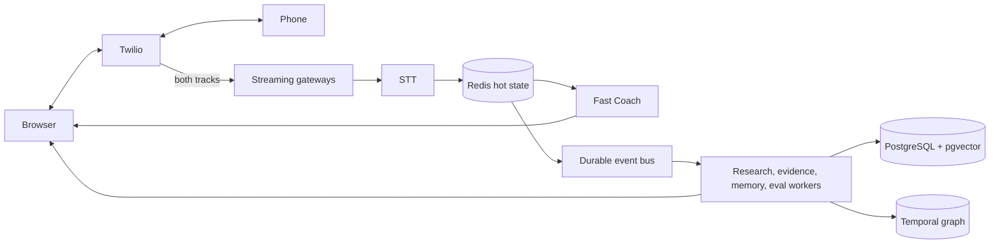

# Production System Design

The prototype bottlenecks are one process, in-memory sessions, provider sockets and synchronous process ownership. First scale streaming gateways horizontally with call/session affinity and Redis hot state; then move research, deep coaching, persistence, graph and evaluation to durable queues/workers. Provider adapters, bounded retries, circuit breakers and fallbacks degrade capability rather than calls. Backpressure drops/reduces noncritical work before realtime transcript delivery.

Track call setup and unexpected termination, stream uptime/gaps, STT and coach P50/P95, stale/generic advice, tool timeouts/cache/source tiers, UI reconnect, unsupported claims and useful feedback. Use tenant IDs, authentication, RBAC, rate limits and tenant-aware traces for multi-user production. Encrypt transport/storage, minimize retention, record consent, regionalize data, audit access, redact PII and store audio only under explicit policy. Cost dimensions are telephony/STT minutes, LLM tokens, tool calls, vector operations and eval sampling; event triggers, caches and small state windows control them.
